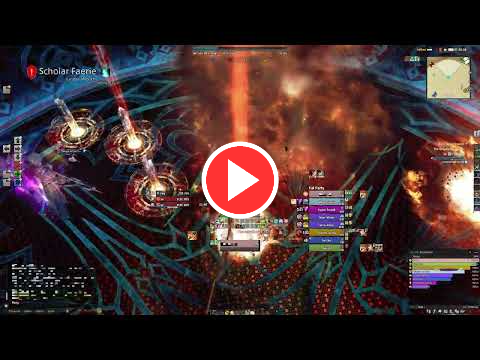

# ZeffUI for DelvUI
This is my previous personal UI after Dawntrail came out.

Here's a video with my UI in use.

## Fonts
Instructions for the fonts can be found here: [Instructions](./Fonts/README.md)

## DelvUI + DelvCD (Unit Frames, Nameplates, Cooldowns)
DelvUI: [Export](./DelvUI.txt)  
DelvCD: [Export](./DelvCD.txt)  (These are optional and very personalized to my own UI)

## Umbra (Toolbar)
Umbra: [Export](./Umbra.txt)

## Kagerou (DPS Meter)
Kagerou: [Export](./Kagerou.txt)  
Kagerou CSS: [Export](./Kagerou.css)  

## LMeter (DPS Meter)
I intend to swapping to LMeter but for now I keep both exports up, they're very close to each other
LMeter: [Export](./LMeter.txt)  